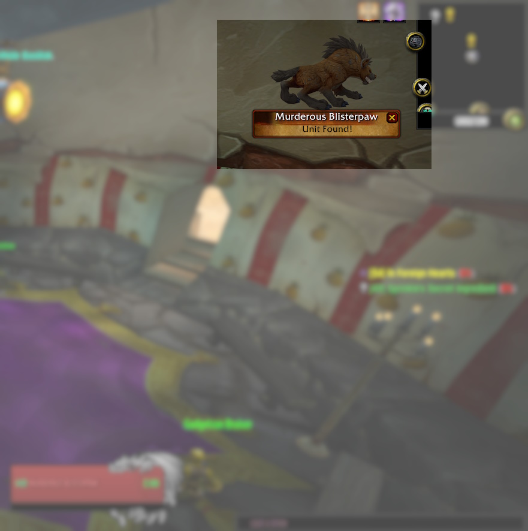
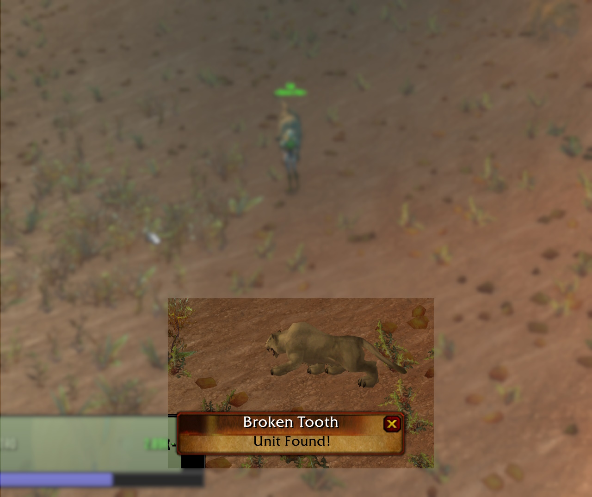
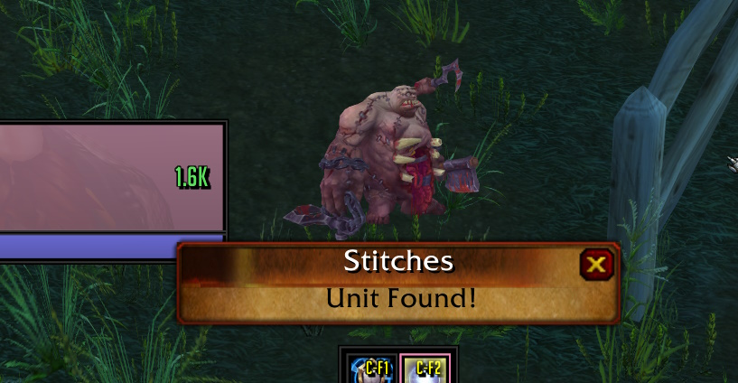

# UnitScan-Turtle (Hardcore Version)

## Description
This fork extends [unitscan-turtle](https://github.com/GryllsAddons/unitscan-turtle) by provinding a prepopulated list of  dangerous elite mobs, rares, and other units. This version is especially useful if you're playing Turtle WoW's hardcore mode.

## Preview

The list of units can be found in [zone targets.lua](https://raw.githubusercontent.com/RetroCro/unitscan-turtle/master/zonetargets.lua).

 - Unitscan will only look for zone targets specific to your current
   zone. The target list is reloaded when you change zones.
   
-   Zone targets will be reloaded 90 seconds after you have found a
   target (to re-detect roaming targets).
   
-   Unitscan will alert you of NPC targets that you can attack and are
   alive.
   
-   **Unitscan will pause scanning when in combat or when auto attack, auto shoot and wanding are active.**  
-   **Please note unitscan-turtle will not auto target the target when it is found.**    
   **Click the target in the unitscan window or use the macro /unitscantarget to target the mob.**

## Commands / Use
**You can move the unitscan frame by holding CTRL+SHIFT+LEFT CLICK dragging.**

**/unitscan** *lists the active scan targets*    
**/unitscan name** *adds/removes **name** to/from the active scan targets*    
**/unitscantarget** *targets the most recently found target*    

You can add custom targets to find players or targets not included in the zone targets list by using the command /unitscan *name*. 

Please Note: Targets added using /unitscan *name* will be removed from active scan targets after they are found. For a permanenet solution, edit [zone targets.lua](https://raw.githubusercontent.com/RetroCro/unitscan-turtle/master/zonetargets.lua) and add a line entry for that unit.

## Complementary Addons
[**SoloRaidTargetIcons**](https://github.com/refaim/SoloRaidTargetIcons) - This addon lets you put raid markers on units without being in a party (see video).

[Codex](https://github.com/nakda/codex/tree/main) - To see target abilities in the tooltip.

## Addon Compatibility
Unitscan uses the [TargetByName](https://wowpedia.fandom.com/wiki/API_TargetByName) function to scan through the list of targets to find an exact match. This causes the game to switch targets if the named target is nearby. Unitscan will immediately restore your original target however if you are using addons that do something when you switch targets (such as issue an alert if targets are PvP flagged) then they may trigger for the found target.
